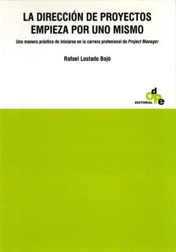
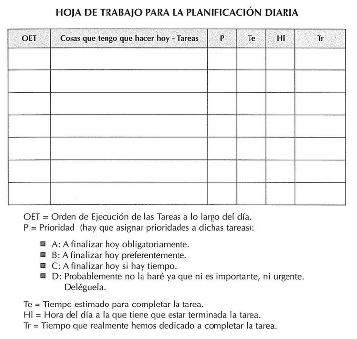
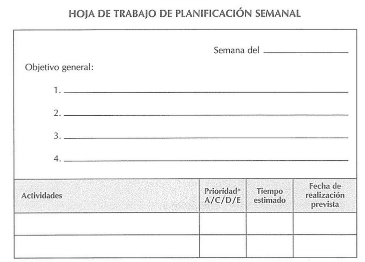
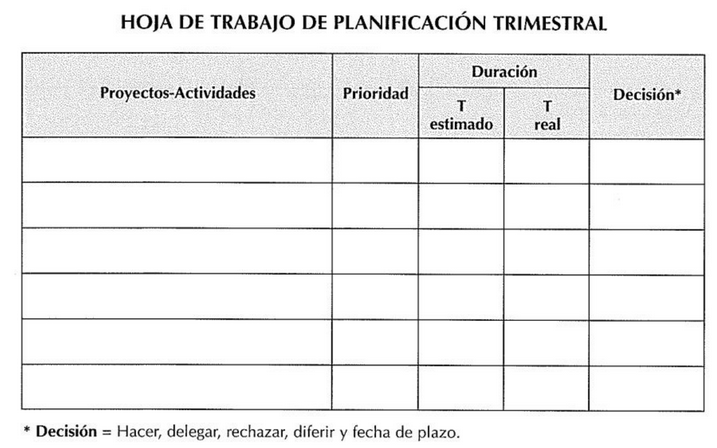

## Acerca del libro

* Nombre: La dirección de proyectos empieza por uno mismo
* Autor: Rafael Lostado
* Link: https://drive.google.com/open?id=1ErSAjirYJHgG5zN3BFxqVI_HOVI7BOFL



[](https://www.youtube.com/watch?v=oP257f4RXok)


## Intro
* Iniciarse en la ciencia y arte de la dirección de proyectos (cuaderno de trabajo)
* Realizar una experiencia de 3 semanas en la que descubrirá cómo se organiza usted y buscar la forma de mejorar su sistema organizativo
* Es difícil dirigir un proyecto con eficiacia si su director-responsable no es una persona organizada
* project manager = "director de proyecto", "proyectista", "responsable de proyectos"

## Capítulo 1: Consideraciones generales
* La "vida" como proyecto
	* Buscar el equilibrio
	* Para ser un director de proyectos competente, hay que empezar por nosotros mismos
	* Descubrir como podemos ser más eficaces
	* Los tres grandes proyectos de mi vida
		* proyecto personal
		* proyecto familiar
		* proyecto profesional
	* Identificar y clarificar los **objetivos** de cada uno de los proyectos de mi vida
		* Elaborar EDT (Estructura de Desglose de Trabajo)
		* Proyecto --> Objetivos genéricos --> Objetivos operativos --> Planes de acción
	````
	Proyecto personal
	- Salud (física, mental y espiritual)
	- Adquisición de conocimientos (cultura)
	- Relaciones con amigos
	- Ocio

	Proyecto familiar
	- Compartir
	- Hij@s
	- Pareja
	- Finanzas personales

	Proyecto profesional
	- emprendimiento --> escuela de desarrolladores .NET
	- Preparación para entrevistas técnicas
	- Inglés
	````
	* Fijar "objetivos genéricos" para cada proyecto de vida
		* con proyección de medio y largo plazo
	* Para conseguir los "objetivos genéricos" es necesario fijar "objetivos operativos"
		* con proyección de corto y mediano plazo
	* Establecer "planes de acción" necesarios para cumplir con los objetivos operativos
	* Con un EDT tenemos una estructura clara para orientarnos
	* Con un EDT nos damos cuenta que todo consume tiempo y que no todo lo podemos hacer a la vez --> AQUI VIENE A TALLAR EL PROJECT MANAGEMENT para la eficaz gestión de nuestras vidas.
	* Si queremos llegar donde nos proponemos debemos recordar lo siguiente:
		* "Sólo se puede controlar lo que se ha planificado anteriormente"
	* Para controlar tu vida planifica:
		* Estimar tiempos
		* Elaborar cronograma
	* Experimentar el project management conmigo mismo
	* Los expertos dicen que 3 semanas como mínimo para convertir una acción en un hábito
* ¿Por qué hay que ser organizados?
	* ¿cómo organizo mi día?
	* Auto-organización
		* Organizarme en los 3 ámbitos de mi vida: personal (PER), familiar (FAM) y profesional (PRO)
		* Práctica
		* Esfuerzo constante
	* No se trata de trabajar mucho, sino de hacerlo bien, a la primera y buscando resultados concretos
	* Acciones eficaces
		* Planificación: poner orden. Objetivos y acciones
		* Programación: ayuda a equilibrar sus vidas personal, familiar y profesional en su espacio y tiempo
* Las ventaja de ser organizados
	* Algunas ventajas
		* tranquilidad mental
		* centrarse en lo importante
		* equilibrio
		* reducir estrés y cansancio
		* ...
	* Mucho que ganar y poco que perder
	* Costo: práctica y esfuerzo
* Conceptos básicos de organización proyectual
	* Plan: Varios programas dirigidos a un mismo objetivo
	* Programa: Grupo de proyectos relacionados y gestionados de forma coordinada
	* Proyecto: Conjunto de actividades para producir bienes/servicios
	* Actividad: Conjunto de tareas para alcanzar los objetivos específicos de un proyecto
	* Tarea: Unidad de trabajo que puede realizar una persona.
* La tarea
	* Es la unidad básica del project management. Es la unidad mínima para la planificación efectiva
	* Duración max: 8hs
	* Tipos de tareas:
		* Tareas de mantenmiento
		* Tareas relacionadas con otras personas
		* Tareas creativas, de planificación y de resolución de problemas


[EDT Proyectos de vida](https://docs.google.com/spreadsheets/d/1zzbap-QjWGYGDlX22UXkHHKY0cckJ4JKdSrO4CzVaOQ/edit#gid=1279699042)


## Capítulo 3: Ladrones de tiempo

Pendiente...

## Capítulo 4: Cómo mejorar su sistema organizativo general

* Técnicas de gestión organizativa
* Temas centrales: 
	* controlar nuestro tiempo
	* conocer los escenarios sobre los que realizar la planificación
	* establecer prioridades
	* tomar decisiones

### Cómo controlar su tiempo

* No es posible ser un eficiente project manager sin ser un buen gestor de tiempo
* Tips para administrar el tiempo con eficiacia:
	* estimar
	* objetivos, acciones, priorizar, delegar
	* controlar tiempo es llevar a cabo las actividades planeadas en el tiempo estimado
	* centralizar toda la información de tus proyectos en un mismo lugar

### Tres escenarios de planificación

* Trabajar en 3 escenarios
	* plan trimestral: visión global
	* plan semanal: 
	* plan diario: 
* plan diario
	* hacerlo a última hora del día anterior
	* unidad de trabajo: la tarea
	* la última tarea del día debería ser: la planificación del día siguiente
	
* plan semanal
	* planificar al final de la semana anterior lo que piensa hacer la próxima semana
	* unidad de trabajo: la actividad
	* plan semanal de objetivos de cumplir y revisar situación día a día
	
* plan trimestral
	* unidad de trabajo: proyecto o actividades significativas  dentro de los proyectos
	* aplicar priorización
	
	

### Establecer prioridades y tomar decisiones
* Separar con presición las tareas, las actividades o los proyectos que debemos encarar
* Jerarquización
	* Tareas importantes y urgentes: requieren atención inmediata
	* Tareas importantes pero no urgentes: relacionado con objetivos de largo plazo
	* Tareas urgentes pero no importantes: delegables
	* Tareas no importantes ni urgentes: no perder tiempo con este tipo de tareas
* SIEMPRE establecer el nivel de prioridad de una tarea, actividad o proyecto
* ¿Cuál es el mejor modo de emplear mi tiempo ahora mismo?
* Distinguir entre las cosas que...
	* debe hacer
	* las que se siente obligado a hacer
	* las que le gustaría realizar 


### Normas generales que parecen funcionar siempre 

* norma 80:20 
	* 80% de los resultados provienen de un 20% de los esfuerzos realizados
	* si usted concentra sus esfuerzos en unas pocas acciones importantes, obtendrá mejores rendimientos
	* si tiene diversos trabajos que realizar y no sabe por dónde empezar, la norma 80:20 puede ayudarle a decidirse --> concentrarse en las acciones que le generen más elevados niveles de retorno a su esfuerzo
* norma 1:10:100
	* importancia de la planificación
	* cada una de la cosas que hacemos pasa por tres fases:
		* concepcion y planificación --> escribir un plan
		* construcción y comprobación --> resultado es un sistema físico 
		* entrega y uso --> el sistema se activa y se mantiene hasta que se acaba su ciclo de vida
	* es menos costoso planificar bien y resolver todos los problemas en la fase de concepción y planificación
* pensamiento sistémico
	* gestionarme a mí mismo como si de un sistema se tratara
	* Yo soy un proyecto sistema
	* los tres subproyectos (persona, familia, profesión) son sus tres subsistemas
	* entender las relaciones entre los diferentes elementos de su proyecto
