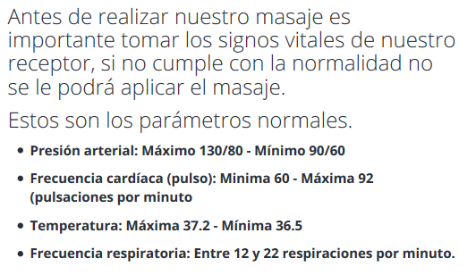
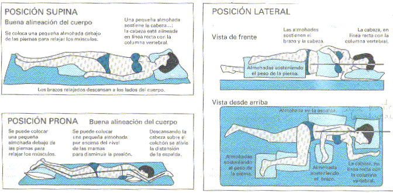

## Acerca del curso

* Curso: 
	* Nombre: Masaje antiestres, Relajación profunda con Masaje sencillo 
	* Link: https://www.udemy.com/course/curso-de-masaje-relajante/
* Profesor: 
	* Nombre: Jorge Carlos Hernández Alvarado, Edith Alvarado Hernandez

## Section 1: Introducción

* Objetivos
	* realizar masaje relajante de cuerpo completo
	* aplicar las terapias a cualquier persona y cobrar ello
* Materiales
	* una camilla
		* a la altura de nuestro puño
		* largo 1,80 m
		* ancho: 70 cm
		* un hueco para que quepa la cara de nuestro receptor --> usar cojín para que no lastime el círculo
	* una sábana de material quirúrjico
		* puede ser de algodón
	* una sábana para cubrir a nuestro receptor
		* cada receptor usa sus propias sábados por medidas de higiene
	* aceite para masajes
		* usar un dosificador para facilitar la aplicación del aceite
	* porta aceitera
		* para evitar tener esparcidos los aceites
	* un cojín redondo
* Aceites
	* necesitamos aceite suaves y naturales
	* Los aceites son muy caros, por tanto solo se ponen unas cuantas gotas
	* aceite esencial
		* llegan a penetrar hasta el torrente sanguíneo
	* para personas con mucha ansiedad
		* aceite esencial preferido bergamota, cítrico muy suave
		* el bergamota ayuda a eliminar estres
		* el bergamota deja la piel hidratada
	* para personas con depresión
		* aceite de ylang ylang: es un antidepresivo
	* aceite esencial de lavanda
		* es anticéptico
		* hidratante
		* relajante
	* aceite esencial geranio
		* para personas con mucho estrés
		* para mujeres mayores de 50 años con piel maltratada
	* Preparación del aceite: en la porta aceitera combinar:
		* 80 ml de aceite base --> aceite de almendras natural, de pepita de uva, de olivo. Si la piel es muy reseca puede ser una aceite de palta
		* 10 gotas de mi aceite esencial
	* Buscar tienes que vendan aceites especiales para masajes
	* Averiguar si nuestro receptor es alérgico a algo. Por ejemplo, a las almendras

## Section 2: El terapeuta

* Ejercicios del terapeuta
	* https://www.udemy.com/course/curso-de-masaje-relajante/learn/lecture/2646452#content
* Posiciones del terapeuta
	* https://www.udemy.com/course/curso-de-masaje-relajante/learn/lecture/2649356#content

## Section 3: Receptor

* Contraindicaciones
	* hay que tener en cuenta en que condición física viene nuestro receptor
	* no dar masajes cuando:
		* hay infeccion
		* inflamaciones agudas
		* problemas cardiovasculares graves
		* várices: no tocar la zonas de várices
		* problemas de la piel: soriasis, dermatitis
		* diabetes: cuando las personas no tienen nivelada su gluosa no hacer masajes
		* cirujías recientes. Se requiere la autorización del médico
		* Heridas abiertas
		* fracturas
		* esguince sin tratar
		* quemaduras
		* cancer: el masaje acelera la metástasis

## Section 4: El masaje

* Parámetros de signos vitales

* Cómo tomar los signos vitales

* Espalda
	* Prono 1 (abanicos y nudillares)
	* Prono 2 (borradores, intervertebrales y paravertebrales)
	* Prono 3 (vibraciones, bamboleo, amasado y olas)
	* Prono 4 (rodamientos y paso de ave)
	* Prono 5 (rastrillo, garra, hormiga y mariposa)
	* Prono 6 (tren)
	* Prono 7 (masaje de escápulas, plumaje y percusiones)

## Donde estudiar

* Masaje miraflores
	* url: http://www.masajemiraflores.pe
	* descripcion: Invidentes son expertos en hacer masajes
	* reportaje: https://www.youtube.com/watch?v=4rqJZ7QMIhQ
 * 

Dogs Get Massages For The First Time
https://www.youtube.com/watch?v=YD9kbp2PHI0
