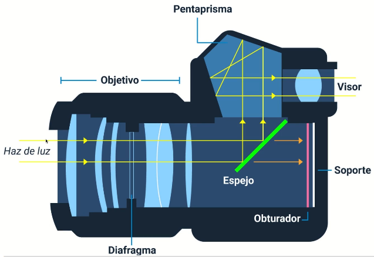
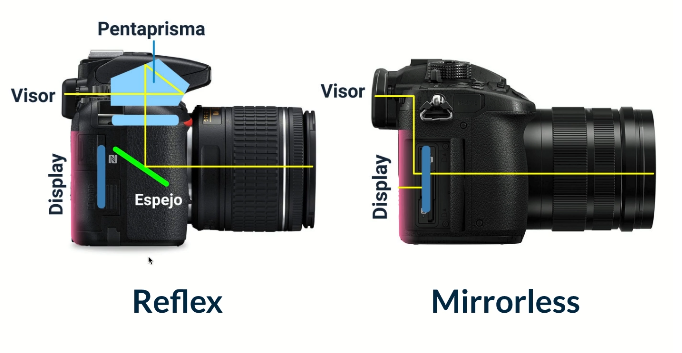

## Acerca del curso

* Curso: 
	* Nombre: Curso de Fundamentos de Fotografía
	* Link: https://platzi.com/clases/fotografia/
* Profesor: 
	* Nombre: Giulia Ducci

## Introducción a la cámara fotográfica

### ¿Qué es una cámara fotográfica?

* Anatomía de una cámara

* Tipos
	* análoga
	* digital
	* digital compacta
* Reflex vs Mirrorless

* Las cámaras compactas usan el sistemas mirrorless

### El formato fotográfico: análogo vs digital
* El formato fotográfico define la dimensión y la relación de aspecto de una imagen.

### Cómo manipular una cámara

* Es importante estar firme
	* http://www.aprendefotografiadigital.com/afd/2010/08/29/aprende-a-sujetar-tu-camara-y-dile-adios-a-las-fotos-movidas/#axzz69hXXJBuS
* La correa
* "Una cámara es una extensión de ti" Así que hay que cuidarla cómo tal!!
* Tus rodillas pueden ser el trípode natural que dan estabilidad a la cámara
* Complementos de la cámara
	* cargador de batería
	* memorias
	* un kit de limpieza
* formas de dar estabilidad a la cámara
	* usando el cuerpo humano (tripode natural)
	* el trípode
* Para el proyecto personal
	* elegir un tema
	* una emoción
	* expresar emociones o contar una historia	
	* alojar proyecto en behance

### ¿Cómo manipular el trípode?

* caraterísticas a tener en cuenta
	* tripode mas pesado es mas estable
	* que aguante más peso que el de mi camara
	* un cabezal fluido es util para grabar videos
* un tripode es util para 
	* fotografías con exposiciones largas
	* fotografías panorámicas
	* fotografía de grupos
	* auto-retratos
* Tarea
	* Tomar una foto inicial para luego compararla con la misma foto al final del curso

## Aprender a medir la luz

## Los Lentes fotográficos

## El arte de fotografíar

## Los géneros fotográficos

## Bases de Iluminación para Fotografía de Interiores

## Curaduría y Proyecto Final

