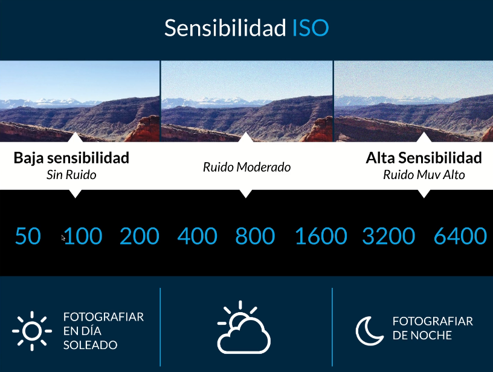

## Acerca del curso

* Curso: 
	* Nombre: Curso de Fundamentos de Fotografía
	* Link: https://platzi.com/clases/fotografia/
* Profesor: 
	* Nombre: Giulia Ducci

## Introducción a la cámara fotográfica

### ¿Qué es una cámara fotográfica?

* Anatomía de una cámara

* Tipos
	* análoga
	* digital
	* digital compacta
* Reflex vs Mirrorless

* Las cámaras compactas usan el sistemas mirrorless

### El formato fotográfico: análogo vs digital
* El formato fotográfico define la dimensión y la relación de aspecto de una imagen.

### Cómo manipular una cámara

* Es importante estar firme
	* http://www.aprendefotografiadigital.com/afd/2010/08/29/aprende-a-sujetar-tu-camara-y-dile-adios-a-las-fotos-movidas/#axzz69hXXJBuS
* La correa
* "Una cámara es una extensión de ti" Así que hay que cuidarla cómo tal!!
* Tus rodillas pueden ser el trípode natural que dan estabilidad a la cámara
* Complementos de la cámara
	* cargador de batería
	* memorias
	* un kit de limpieza
* formas de dar estabilidad a la cámara
	* usando el cuerpo humano (tripode natural)
	* el trípode
* Para el proyecto personal
	* elegir un tema
	* una emoción
	* expresar emociones o contar una historia	
	* alojar proyecto en behance

### ¿Cómo manipular el trípode?

* caraterísticas a tener en cuenta
	* tripode mas pesado es mas estable
	* que aguante más peso que el de mi camara
	* un cabezal fluido es util para grabar videos
* un tripode es util para 
	* fotografías con exposiciones largas
	* fotografías panorámicas
	* fotografía de grupos
	* auto-retratos
* Tarea
	* Tomar una foto inicial para luego compararla con la misma foto al final del curso

## Aprender a medir la luz

### ¿Qué es la exposición fotográfica?
La exposición fotográfica es la cantidad de luz necesaria para crear una imagen en el soporte y se mide a través de 3 parámetros:
* Sensibilidad a la luz del soporte.
* Tiempo de exposición a la luz.
* El diafragma de tu cámara.

ISO es una convención a nivel mundial para expresar la sensibilidad a la luz de nuestro soporte y se expresa en valores numéricos.

Apertura del diafragma

¿Qué es es una buena exposición correcta?
Una fotografía puede llegar a estar subexpuesta o sobreexpuesta. Las fotografías subexpuestas tienden a ser más oscuras ya que tienen menos luz, mientras que las sobreexpuestas tienen un alto nivel de luz.

Exposímetro

### El obturador y el tiempo de exposición
El obturador se encarga de controlar el tiempo de entrada de la luz, sus medidas van desde segundos enteros hasta fracciones de segundo.

Un tiempo de exposición corto va a “congelar” el movimiento del objeto que estés tomando, mientras que un tiempo más largo va a captar el movimiento.

Modos de disparo P-A-S-M
https://www.casanovafoto.com/blog/2014/04/modos-de-disparo-p-a-s-m/

### La sensibilidad a la luz de un soporte

próximamente

### El diafragma y la profundidad de campo

El diafragma se encuentra en el lente fotográfico
El diafragma funciona como un ojo humano
El diafragma está conformado por una serie de láminas que se abren y cierra según el número que le damos: f/5.6, f/8, f/22

Cuando tenemos un diafrgama muy abierto, tenemos el foco sólo el sujeto
Cuando tenemos un diafragma muy cerrado, tenemos el foco en el sujeto y el fondo

La profundidad de campo es el foco que tengo en el sujeto 

Cuando quieras que el foco esté en el sujeto, entonces tienes que usar una apertura de diafragma muy amplia

TODO: diferenciar diafragma y obturador

### ¿Cómo medir la luz con la cámara fotográfica?

TODO: averiguar como medir la luz en Nikon 

### Subexposición y sobreexposición con fines creativos

Sobreexposición para comunicar 
* suavidad

Subexposición para transmitir
* misterio
* fantasmagórico
* desolación

## Los Lentes fotográficos

## El arte de fotografíar

## Los géneros fotográficos

## Bases de Iluminación para Fotografía de Interiores

## Curaduría y Proyecto Final

## Anexo 1

### Conceptos básicos 

Fuente: https://www.youtube.com/watch?v=OfGgVepGyC4

Qué es la fotografía
* Consiste en crear imágenes a partir de la luz
* Lo primordial en fotografía es saber controlar la luz
* Para **controlar la luz**, nuesra cámara nos da herramientas 

Partes de la cámara
* Tiene dos grandes bloques
	* el objetivo: Encargado de dar nitidez y enfocar la imagen. En su interior está el **diafragma** que es una de las herramientas básicas que controla la cantidad de luz que llega al sensor
	* el cuerpo: Contiene el sensor. Delante del sensor se encuentra el **obturador** que es una especie de cortina que controla el tiempo que llga luz al sensor
* Las tres herramientas fundamentales para controlar la luz son:
	* El diafragma: se encuentra en el objetivo y mide la **cantidad de luz** que entra al sensor
	* El obturador: mide la **cantidad de tiempo** que el sensor está expuesto a la luz
	* La sensibilidad ISO: Es la **cantidad de sensibilidad** que le queremos dar a nuestro sensor. 

### El obturador

Fuente: https://www.youtube.com/watch?v=TtRIr_p_FvI

* Es una especie de cortina que está delante de nuestro sensor que se abre y se cierra a nuestro antojo y controla la cantidad de tiempo que pasa la luz
* A mayor tiempo abierto, más luz entrará y menor tiempo abierto menos luz entrará
* El obturador se mide en tiempo. Mediante el dial de la cámara podemos controlar ese tiempo
	* 1/50, 1/80 .... 1/1600
	* Si el número es muy alto, por ejemplo 1/4000 de segundo nuestro obturador se abrirá y cerrará muy rápido
* Si bien es cierto que el obturador sirve para controlar la luz, un efecto secundario es **la velocidad de obturación** lo cual permite hacer una fotografía o muy rápido o muy lento
* Si hacemos la foto con una velocidad alta de obturación, entonces congelaremos el momento
* Si elegimos una velocidad baja de obturación y la foto saldrá movida

### El diafragma

Fuente: https://www.youtube.com/watch?v=GlVZNb2Q_OE

* El diafragma mide la cantidad de luz que entra al sensor
* El diagragma se encuentra en el objetivo y es una especie de anillo que se abre y cierra
* Para controlar la apertura del diafragma usar el dial de la cámara. En la pantalla lo identificaremos con un número con una F delante. Este es el indicador que mide el diámetro del diafragma
	* Si es muy pequeño, por ejemplo f1.8, nuestro diafragma estará muy abierto
	* Si es muy grande, por ejemplo f14, nuestro diafragma estará muy  cerrado. Entrará muy poca luz a nuestro sensor
* Para controlar el diafragma en la cámara mantenemos presionado el botón (+/-) y movemos el dial 
* Además de ayudarnos a controlar la luz, tiene como efecto secundario es la **profundidad de campo**. Coloquialmente es la zona que está enfocada en la imagen
* Con el diafragma podemo hacer que toda la imagen esté enfocada o que sólo una zona muy pequeña esté enfocada y el resto de la imagen esté desenfocada

### El sensor

Fuente: https://www.youtube.com/watch?v=RqRVWmdGKWM

* El sensor es la pieza más importante de nuestra cámara
* La sensibilidad ISO se la damos a nuestro sensor y podemos indicar más o menos sensibilidad
* Para controlar la sensibilidad ISO en nuestar cámara usamos 
* Mientras menor sea el número, por ejemplo ISO 100, quiere decir que nuestro sensor no tiene mucha sensibilidad a la luz
* Se podría decir coloquialmente que la sensibilidad ISO es una especie de luz artificial que entra al sensor para ayudarte en ciertas escenas donde falta luz
	* interiores
	* fotos de noche
	* paisaje nocturno

* El efecto de la sensibilidad ISO es el **ruido (granos)** en la foto, efecto que nadie quiere conseguir.
* Se recomienda usar la sensibilidad ISO lo más baja posible y es una ayuda que se intenta evitar porque baja la calidad de la imagen

### El modo manual

Fuente: https://www.youtube.com/watch?v=_DggQIxlhkw

* Entender como se complementan las 3 herramientas para controlar la luz
* La principal función de la fotografía es **exponer** correctamente. Exponer signfica lograr una foto con una correcta luz para que se vea bien
* Para hacer una correcta exposición de la luz tenemos que conocer el triángulo de exposición, en el cual vemos como las 3 herramientas se complementan.

El exposímetro
Es una línea con extremos de positivo y negativo 
Cuando la flecha esté en el centro, tendremos una correcta exposición

En resumen:
* Tenemos que elegir el efecto que queremos conseguir
* Luego tenemos que complementar las herramientas para conseguir una exposición correcta

