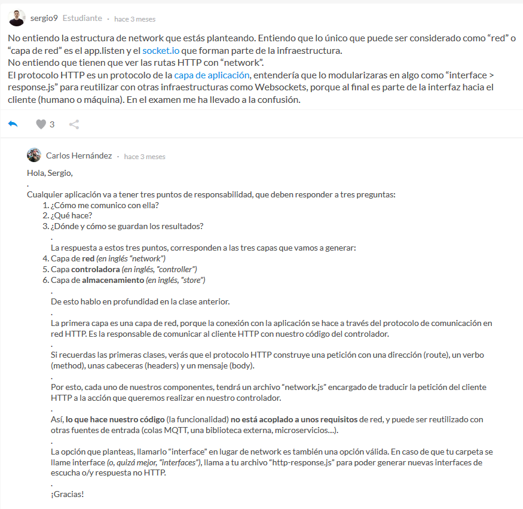

## Acerca del curso

* Curso: 
	* Nombre: Curso de Node.js
	* Link: https://platzi.com/cursos/backend-js/
	* Repositorio: https://github.com/CodingCarlos/backend-node-platzi
* Profesor: 
	* Nombre: Carlos Hernández
	* Twitter: https://twitter.com/CodingCarlos

otro curso relacionado de Node.js
https://platzi.com/clases/backend-nodejs/


## Módulo 1

### Qué es Node y cómo instalarlo
* Node.js es un entorno en tiempo de ejecución multiplataforma de código abierto para la capa del servidor basado en el lenguaje de programación ECMAScript, asíncrono y basado en el motor V8 de Google.
* También se puede usar NodeJS para desarrollar herramientas, por ejemplo: webpack, Babel, PM2, electron
* Descargar e instalar la versión LTS

### Peticiones HTTP
* Una petición HTTP es un protocolo de comunicación que permite las transferencias de información en la web.
* Es el lenguaje común para todas las comunicaciones.
* ¿Cómo es una petición?
````
GET /index.html HTTP/1.1
Host: www.example.com
Referer: www.google.com
User-Agent: Mozilla/5.0
Connection: keep-alive
````
* Puntos claves a tener en cuenta:
	* Métodos: Qué quieres hacer
    * Estado: Cómo ha ido la operación
    * Cuerpo: Lo que el servidor devuelve


### Métodos, cabeceras y estados
* Métodos HTTP: El verbo que dice "lo que queremos hacer" al servidor
	* GET: Recoger información del servidor.
    * POST: Añadir información al servidor.
    * PUT: Reemplazar información en el servidor.
    * PATCH: Actualizar parte de la información.
		* Cambiar la foto de un usuario
		* Modificar el precio de un producto
    * DELETE: Eliminar información del servidor.
    * OPTIONS: Pedir información sobre métodos (saber si podemos ejecutar alguno de los métodos anteriores).
		* Si inspeccionamos en la consola del navegador veremos que cada vez que se ejecuta una petición POST, PUT, PATCH, DELETE justo antes se ejecuta una petición OPTIONS que nos devuelve un OK.
* Las cabeceras serán el envío al servidor de cómo queremos hacer la petición.
	* Información contextual de la petición
	* No es lo que quiero hacer, sino cómo lo quiero hacer
	* En request de tipo POST, PUT, PATCH podemos tener cabeceras de
		* autenticación
			* Asegurarte de que puedes pedir cosas al servidor
			* cabecera Authorization
		* cache
			* Almacenamiento temporal
			* Gestionar durante cuánto tiempo la respuesta será la misma
			* Cache-Control
			* Expires
		* indicaciones
		* condiciones
		* CORS
			* compartir recursos entre diferentes orígenes
			* Manejar información desde fuera de nuestro servidor
			* Cabecera: Access-Control-Allow-Origin
		* cookies
			* Sirven para compartir información entre peticiones
		* Accept
			* Define el contenido que acepta: json, xml, con un charset determinado
* Los estados son números que indica el estado de la petición:
    * 2XX: Todo ha ido bien.
		* 200: Ok
		* 201: Created
    * 3XX: La petición se ha redirigido.
		* 301: Moved permanently
		* 304: Not modified
    * 4XX: Errores del cliente.
		* 400: Bad request --> algo haz enviado mal
		* 401: Unauthorized --> no sé quién eres
		* 403: Forbidden --> si sé quién eres, pero no te puedo dar esto porque no tienes permisos
		* 404: Not found
    * 5XX: Ha habido un error al procesar la petición (errores del servidor)
		* 500: Internal server error

http://www.cheat-sheets.org/saved-copy/http-response-codes-1.pdf
https://httpstatuses.com/
https://http.cat/


### Cuerpo y query de la petición
* El cuerpo de la petición es la información en sí que queremos enviar, editar o que el servidor nos devuelva.
* Las queries van a permitirte añadir información extra a los datos que queramos enviarle al servidor.
* El cuerpo
	* La información de la petición
	* Los datos del usuario que quieres añadir
	* Depende de las cabeceras
		* Content-Type --> con esta info el navegador sabrá como procesar la respuesta
			* text/html
			* text/css
			* application/javascript
			* image/jpeg
			* application/json
			* application/xml
		* Content-Length
		````
		[POST]
		http://api.com/user
		-> content-type: application/json
		{
			"name": "javier",
			"username": "jguerrero"
		}
		````
* Query
	* Información extra
	* Orden en el que quieres que se devuelvan los datos
	* Parámetros que quieres medir
	````
	youtube.com/watch?v=ZKFwOFBwQFU
	api.com/person?orderBy=name&age=25
	````
	* Una forma de compartir datos con el frontend
		* OJO, el usuario lo verá, así que cuidado con lo que compartes
	* Estructura
		* Añadir ? al final de la URL
		* nombre=valor
		* separarlos con ampersand

## Módulo 2

### Crear un servidor HTTP desde NodeJS

* VSCode: abrir terminal --> View/Terminal
* Comprobar que node está funcionando
````
node --version
````
* Cuando instalamos Node.js, se nos instala NPM
	* NPM = Node Package Manager
	* Nos va a permitir trabajar con paquetes en node (paquete = librería)
* Vamos a crear nuestro paquete
````
npm init
````
* El **entry point** es el punto de entrada hacia nuestro paquete, el primer archivo javascript que se va a ejecutar 
* Vamos a utilizar una librería para crear servidores en node.js: express
````
npm i express
````
* La forma de invocar módulos es la siguiente
````
const express = require('express');
o
import express from 'express';
````
* Para ejecutar una aplicación de express:
````
node server
````

### ¿Cómo pueden venir las peticiones?

* Insomnia: programa para hacer peticiones HTTP
* Para gestionar los distintos tipos de peticiones, vamos a utlizar el router de express
* Matar el servidor -> Ctrl + C
* Los parámetros req y res forman parte de una función HTTP. 
	* req es el acrónimo de request, que significa solicitud, contiene toda la información de la solicitud, incluidos los paramétros de la solicitud, los encabezados, el cuerpo de la solicitud y más.
	* res es el acrónimo de response, que significa respuesta, contiene la respuesta a la solicitud.

### Recibir información desde el cliente: Body y Query

* Instalar **nodemon** para que cada vez que haya un cambio en nuestro proyecto se reinicie el servidor

```
npm install -g nodemon 
```
* Luego, en vez de ejecutar con **node server** ahora usar
```
nodemon server
```
* Para trabajar con el Body instalamos el BodyParser
```
npm i body-parser
```
* El body siempre lo encontramos en el request

### Información contextual: Leer las cabeceras

* req.headers nos va a incluir la cabecera
* el **user-agent** es el navegador que está usando el usuario (chrome, firefox, postman)
* Cabeceras útiles
	* cache-control --> para especificar cache para imágenes, archivos de js
	* user-agent --> para saber si es mobile, apple, windows, linux, etc.
	* accept
	* accept-language
* Se pueden definir cabeceras personalizadas

### Tipos de respuesta: Vacía, plana, con datos y estructurada

* Se puede devolver un estado
```
router.post('/demo', function(req, res){
    res.status(201).send();
});
```
* Respuesta estructurada
```
router.post('/demo', function(req, res){
    res.status(201).send({error:'', body:'Creado correctamente'});
});
```

### Respuestas coherentes

* Crear un módulo que se encarga de responder nuestras peticiones


### Servir archivos estáticos

* NodeJS es muy bueno para responder cualquier tipo de petición porque no se bloquea
```
app.use('/app', express.static('public'));
```

### Errores: Cómo presentarlos e implicaciones en la seguridad

* Hay que ser muy cuidadosos con la información que entregamos al cliente.
* Hacer logging de los errores
* Para agregar colores al mensaje de error podemos instalar chalk
```
npm i chalk
```

Luego para usarlo:
```
// response.js
const chalk = require('chalk')

// ...
exports.error = (req, res, error, status, details) => {
  console.log(chalk.red('[response error]: ' + details))
  res.status(status || 500).send({
    error: error,
    body: ''
  })
}
```

## Módulo 3

### Conceptualmente: Rutas, controladores y bases de datos

* server.js: encargado de recibir las peticiones 
* routes.js: gestiona las rutas





### Rutas y capa de red: Responsabilidades y límites

* 

### Controladores: Definiendo la lógica de negocio

* Error first pattern for JavaScript Async/Await. https://examples.dev/articles/error-first-pattern-for-es7-async-await/


### Almacenando la información en una base de datos

* Toda la lógica de almacenamiento de datos se almacena en un archivo diferente
* Un Mock es falsear la base de datos o un servicio para validar que todo funciona correctamente

## Módulo 4

### Tipos de Bases de Datos: Relacionales y No Relacionales

* Bases de Datos Relacionales: no es una base de datos muy flexible, pero tiene a favor su gran soporte y el enorme desarrollo en herramientas para su uso. Si necesitamos cambiar un valor de un campo debemos hacerlo con todos los campos de nuestra BD, en cambio con NoSQL o No Relacional no es así.
* Bases de Datos No Relacionales: son de bases de datos sin una tabla fija como las que sí se encuentran en las bases de datos relacionales, lo que permite una alta escalabilidad en ellas. Además, es abierta y por lo tanto flexible a diferentes tipos de datos y no necesita tantos recursos para ejecutarse; de hecho, el hardware necesario no cuesta mucho.
* Cuando se tiene que hacer consultas muy complejas, las BD relacionaes no escalan
* Para las bases de datos relacionales usamos el lenguaje de consulta SQL
* Para las bases de datos NO relacionales usan sus propias librerías de consultas
	* bases de datos de documentos
	* bases de datos de documentos relacionados --> MongoDB
	* bases de datos clave-valor --> Cassandra
	* bases de datos de grafos --> Neo4j
* Las BD No relacionales puede ser útil para la construccion de aplicaciones prototipos (aplicaciones que cambien mucho)

### Crear y configurar tu BD con MongoDB

* MongoDB Atlas es un servicio de bases de datos como servicio
* Atlas es un servicio mantenido por el equipo que desarrolla MongoDB
* Crear una cuenta en MongoDB Atlas --> https://www.mongodb.com/cloud/atlas
* https://platzi.com/clases/1646-backend-nodejs/22033-creacion-de-una-bd-en-mongoatlas/


### MongoDB I: Almacenar y leer datos

* MongoDB no tiene esquemas, pero es buena práctica tenerlo
* La librería "mongoose" nos va a permitir crear esquemas 
```
npm i mongoose
```


### MongoDB II: Actualizar datos

* Lo ideal es que todas tus respuestas sean estándares. Una función asíncrona (async function) devuelve una promesa.
* Si vamos a devolver una promesa que viene de otro módulo, no tiene sentido esperar a que se resuelva pudiendo pasar la referencia. Sin embargo, en caso de control de errores, podemos querer que la promesa se comporte de una forma determinada.
* Ahí es cuando podemos usar los constructores, o las funciones Promise.reject() o Promise.resolve()


### MongoDB III: Consultar datos

codigo

### Mongo DB IV: Eliminar datos

codigo

### Gesionar conexiones a la base de datos desde la API

* Formas de gesionar las conexiones de la BD
	* crear una nueva conexion que se abre y se cierra en cada peticion
	* Compartir la conexion


## Módulo 5

### Escalando la arquitectura: Múltiples entidades

* 

### Relacionando nuestras entidades

* 

### Cómo recibir ficheros desde NodeJS

* 

### Guardar el fichero en el servidor

* 

