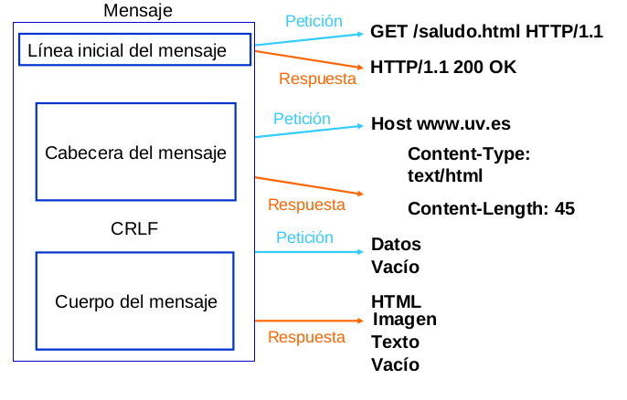

## Acerca del curso

* Curso: 
	* Nombre: Curso de Node.js
	* Link: https://platzi.com/cursos/backend-js/
* Profesor: 
	* Nombre: Carlos Hernández
	* Twitter: https://twitter.com/CodingCarlos

## Módulo 1

### Qué es Node y cómo instalarlo
* Node.js es un entorno en tiempo de ejecución multiplataforma de código abierto para la capa del servidor basado en el lenguaje de programación ECMAScript, asíncrono y basado en el motor V8 de Google.
* También se puede usar NodeJS para desarrollar herramientas, por ejemplo: webpack, Babel, PM2, electron
* Descargar e instalar la versión LTS

### Peticiones HTTP
* Una petición HTTP es un protocolo de comunicación que permite las transferencias de información en la web.
* Es el lenguaje común para todas las comunicaciones.
* ¿Cómo es una petición?
````
GET /index.html HTTP/1.1
Host: www.example.com
Referer: www.google.com
User-Agent: Mozilla/5.0
Connection: keep-alive
````
* Puntos claves a tener en cuenta:
	* Métodos: Qué quieres hacer
    * Estado: Cómo ha ido la operación
    * Cuerpo: Lo que el servidor devuelve



### Métodos, cabeceras y estados
* Métodos HTTP: El verbo que dice "lo que queremos hacer" al servidor
	* GET: Recoger información del servidor.
    * POST: Añadir información al servidor.
    * PUT: Reemplazar información en el servidor.
    * PATCH: Actualizar parte de la información.
		* Cambiar la foto de un usuario
		* Modificar el precio de un producto
    * DELETE: Eliminar información del servidor.
    * OPTIONS: Pedir información sobre métodos (saber si podemos ejecutar alguno de los métodos anteriores).
		* Si inspeccionamos en la consola del navegador veremos que cada vez que se ejecuta una petición POST, PUT, PATCH, DELETE justo antes se ejecuta una petición OPTIONS que nos devuelve un OK.
* Las cabeceras serán el envío al servidor de cómo queremos hacer la petición.
	* Información contextual de la petición
	* No es lo que quiero hacer, sino cómo lo quiero hacer
	* En request de tipo POST, PUT, PATCH podemos tener cabeceras de
		* autenticación
			* Asegurarte de que puedes pedir cosas al servidor
			* cabecera Authorization
		* cache
			* Almacenamiento temporal
			* Gestionar durante cuánto tiempo la respuesta será la misma
			* Cache-Control
			* Expires
		* indicaciones
		* condiciones
		* CORS
			* compartir recursos entre diferentes orígenes
			* Manejar información desde fuera de nuestro servidor
			* Cabecera: Access-Control-Allow-Origin
		* cookies
			* Sirven para compartir información entre peticiones
		* Accept
			* Define el contenido que acepta: json, xml, con un charset determinado
* Los estados son números que indica el estado de la petición:
    * 2XX: Todo ha ido bien.
		* 200: Ok
		* 201: Created
    * 3XX: La petición se ha redirigido.
		* 301: Moved permanently
		* 304: Not modified
    * 4XX: Errores del cliente.
		* 400: Bad request --> algo haz enviado mal
		* 401: Unauthorized --> no sé quién eres
		* 403: Forbidden --> si sé quién eres, pero no te puedo dar esto porque no tienes permisos
		* 404: Not found
    * 5XX: Ha habido un error al procesar la petición (errores del servidor)
		* 500: Internal server error

http://www.cheat-sheets.org/saved-copy/http-response-codes-1.pdf
https://httpstatuses.com/
https://http.cat/


### Cuerpo y query de la petición
* El cuerpo de la petición es la información en sí que queremos enviar, editar o que el servidor nos devuelva.
* Las queries van a permitirte añadir información extra a los datos que queramos enviarle al servidor.
* El cuerpo
	* La información de la petición
	* Los datos del usuario que quieres añadir
	* Depende de las cabeceras
		* Content-Type --> con esta info el navegador sabrá como procesar la respuesta
			* text/html
			* text/css
			* application/javascript
			* image/jpeg
			* application/json
			* application/xml
		* Content-Length
		````
		[POST]
		http://api.com/user
		-> content-type: application/json
		{
			"name": "javier",
			"username": "jguerrero"
		}
		````
* Query
	* Información extra
	* Orden en el que quieres que se devuelvan los datos
	* Parámetros que quieres medir
	````
	youtube.com/watch?v=ZKFwOFBwQFU
	api.com/person?orderBy=name&age=25
	````
	* Una forma de compartir datos con el frontend
		* OJO, el usuario lo verá, así que cuidado con lo que compartes
	* Estructura
		* Añadir ? al final de la URL
		* nombre=valor
		* separarlos con &


## Módulo 2


