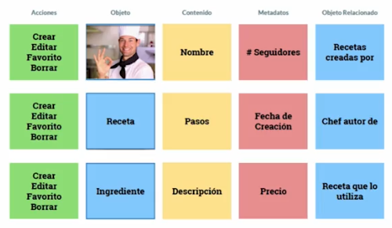

## Acerca del curso

* Curso: 
	* Nombre: Introducción al Diseño de Prototipos
	* Link: https://platzi.com/clases/prototipado/
* Profesor: 
	* Nombre: Misael León
	* Linkedin: https://www.linkedin.com/in/misaelleon/
	* Blog: https://sg.com.mx/buzz/autores/misael-leon

## Beneficios del prototipado

* Pone a todo el equipo en la misma sintonía:
	* Product Manager: impulsa su visión de negocio
	* Desarrollor: pelea por lo que es posible construir
	* Diseñador: lucha por su visión central en el usuario
* Un prototipo es una simulación del producto final en diferentes grados de fidelidad
	* Baja fidelidad: Boceto en papel 
	* Mediana fidelidad: Wireframe
	* Alta fidelidad: representación de lo que se va a construir
* Expone rápidamente una solución ante los usuarios
* Pone en evidencia problemas críticos antes de construir
	* Esto es sensible porque el costo de desarrollo es muy alto
* Mejora la comunicación del equipo respecto de lo que se construirá
* Ayuda al Product Manager a definir un roadmap preciso
* Cursos complementarios:
	* Diseño de interfaces y UX
	* User Reserarch

## Niveles de fidelidad

* Baja fidelidad
	* Boceto en papel
	* Es posible aplicar pruebas de usabilidad sobre un prototipo en papel (Buscar pruebas de usabilidad en papel)
	* Pros
		* rápidos
		* bajo costo
		* produce acuerdos
	* Cons
		* No es realista
		* No es detallado
* Mediana fidelidad
	* Con mucho más detalle
	* Generalmente se utiliza una herramienta: UXPin, Moqups, Balsamiq
	* Normalmente son blanco y negro para evitar distracciones
	* Pros
		* Más realista, se asemeja más a lo que vamos a construir
		* Flexible porque no hay colores, tipografía, etc. definidas
		* Iteración rápida, como todavía no está en producción podemos modificar lo que necesitemos
	* Cons
		* Requiere tiempo: 1d, 2d, ...
		* Requiere curva de aprendizaje: aprender a utilizar las herramientas
		* No interacciones
* Alta fidelidad
	* Colores, tipografía, iconografía
	* Es el paso final antes de construir
	* Pros
		* Fundamento técnico del producto: se muestran los elementos listo para programarse
		* Diferentes plataformas: mobile, desktop
		* Certero a la realidad
	* Cons:
		* Producción lenta: se producen todas las pantallas de toda la interacción
		* Puede inhibir creatividad: ya se han tomado muchas decisiones y tenemos que apegarnos a ellas
		* No es flexible: aplica lo anterior
* Arreglar, rehacer y desechar es muy costoso ... mucho

## Introducción a Patrones de Diseño

* Un patrón es una solución dada para un problema ya reconocido
	* Problema: Necesitamos mostrar una lista de elementos
	* Problema: Necesitamos que cada elemento se pueda tocar para mostrar más detalle
	* Problema: Las imágenes son realmente importantes, entonces una lista no nos sirve

* Catálogo de patrones
	* https://pttrns.com

## Introducción a UX Orientado a Objetos

* UX Orientado a Objetos = Metodología para estructurar un sistema digital basado en objetos reales.
* Autora del método: Sophia V. Prater
* Es una metodología que está alineada a la manera de pensar de los usuarios.
* Esta metodología pone en primer plano a los objetos y el contenido antes que a las acciones.
* Identificar
	* Objetos: personas, fotos, seguidores
	* Acciones: buscar, seguir, comentar, DarLike
* El mundo digital es similar al mundo en el que interactuamos
* Los usuarios andan buscando objetos: video, persona, receta...
* Ejercicio:
	* Identificar objetos
	* Cuáles son los atributos de objeto (contenido)
	* Los metadatos que describen el objeto (?)
	* Objetos anidados
	* Las acciones que el usuario aplica a ese objeto
* Mas info:
	* Designing Object-Oriented User Interfaces (libro)
	* https://alistapart.com/article/object-oriented-ux/
	* https://uxdesign.cc/atomic-design-how-to-design-systems-of-components-ab41f24f260e
	* https://docs.google.com/document/d/1aNqhwmWaSWpoZw7oeiehiCv75hcahXKNSwjur__nGE0/edit
	* https://sg.com.mx/revista/53/c-mo-estructurar-el-contenido-tu-aplicaci-n
* Tarea: 
	* Identificar los objetos de GastroTour y las aplicaciones que se le aplicarían a esos objetos...
	* Para esto es necesario leer un documento de requerimientos

## Wireframes en papel (baja fidelidad)

* Requisito: haber detectado los objetos (aplicar OOUX)
* No tiene que ser perfecto, solamente hay que indicar donde van los elementos
* Lapiz y papel
* Probar prototipos en papel: https://www.youtube.com/watch?v=kXyTKUF0tTY
* Google Prototyping: https://www.youtube.com/watch?v=JMjozqJS44M

## Wireframes digitales (mediana fidelidad)

pendiente...

## Introducción al Diseño Modular

* Consiste en construir interfaces por bloques
* Estos bloques son componentes reusables e independientes
* Componentes fácil de reparar, modificar, mejorar y mantener
* Fundamentos de librerías de estilos y componentes compartidos

## Prototipo en Alta Fidelidad

pendiente...

## Construcción de un prototipo clickeable

* Herramienta: https://www.invisionapp.com/

